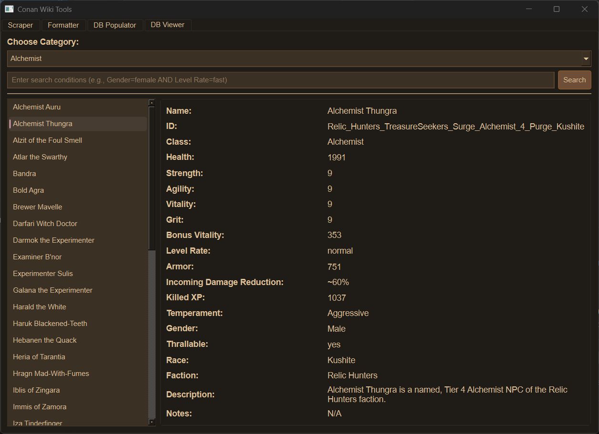

# Conan Wiki Tools

A unified desktop application for scraping, formatting, and viewing Conan Exiles wiki data, specifically focused on thrall information.



## Features

- **Wiki Scraper**: Downloads all pages from the Conan Exiles Fandom wiki using the MediaWiki API with progress persistence and error recovery
- **Data Formatter**: Processes scraped wiki text files to extract and format thrall, NPC, creature, and pet data
- **Database Populator**: Imports formatted data into a SQLite database with data validation
- **Database Viewer**: Browse and search thrall data with an intuitive interface supporting case-insensitive queries

### Key Enhancements

- **Progress Persistence**: Scraping can resume from interruptions
- **Error Recovery**: Automatic retry with exponential backoff for network issues
- **Data Validation**: Ensures data integrity before database insertion
- **Comprehensive Coverage**: Handles thralls, NPCs, creatures, and pets
- **User-Friendly UI**: Tooltips and intuitive controls throughout

## Installation

1. Clone or download this repository
2. Install Python 3.11+
3. Create a virtual environment (recommended):
   ```bash
   python -m venv .venv
   .venv\Scripts\activate  # On Windows
   ```
4. Install dependencies:
   ```bash
   pip install -r requirements.txt
   ```

## Usage

Run the application:
```bash
python main.py
```

### Workflow

1. **Scrape Data**: Use the Scraper tab to download wiki pages as text files (supports resuming interrupted downloads)
2. **Format Data**: Use the Formatter tab to process the scraped files into structured data for thralls, NPCs, creatures, and pets
3. **Populate Database**: Use the DB Populator tab to import formatted data into the database (validates data integrity)
4. **View Data**: Use the DB Viewer tab to browse and search information with advanced query support

### Search Examples

- View all female thralls: `Gender=female`
- Find fast-leveling fighters: `Class=fighter AND Level Rate=fast`
- Search by faction: `Faction=Darfari`

## Requirements

- Python 3.11 or later
- PySide6 (Qt6-based GUI)
- requests (HTTP client)
- beautifulsoup4 (HTML parsing)
- SQLite (built-in with Python)

## Project Structure

```
ConanWikiTools/
├── main.py                 # Main application
├── requirements.txt        # Python dependencies
├── README.md              # This file
├── LICENSE                # MIT License
├── .gitignore            # Git ignore rules
├── thralls.db            # SQLite database (created automatically)
└── screenshot.png        # Application screenshot
```

## Development

The application uses a virtual environment for dependency management. All data is stored locally in SQLite format.

## License

This project is licensed under the MIT License. See the [LICENSE](LICENSE) file for details.